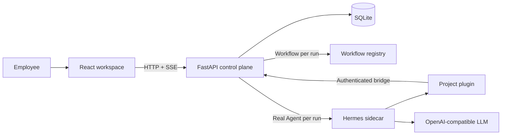

# Architecture

## System boundaries

React owns interaction and rendering. FastAPI owns the stable public contract,
run state, persistence, approvals, event normalization, and runtime selection.
The selected runtime is stored on every run, allowing both modes in one
conversation. The `关键词分析` Workflow is a deterministic six-step DAG over
synthetic data; it emits the same normalized events as live tools. Hermes owns
only the live agent loop. The project plugin adds business tools and
approval hooks without changing upstream source. SQLite makes refresh and SSE
reconnection recoverable instead of relying on browser memory.

## Request lifecycle and Trace

The eleven labels below are an explanatory lifecycle adapted from Claude Code
Unpacked, not eleven source folders:

| Stage | ZC Agent Desk responsibility |
| --- | --- |
| Input | React validates and sends the employee message. |
| Message | FastAPI persists the user message and creates a run. |
| History | Prior persisted messages are loaded for multi-turn context. |
| System | Runtime instructions and available tools define behavior. |
| API | Workflow runs locally; Real Agent calls the configured compatible endpoint. |
| Tokens | Streaming deltas become ordered `message.delta` events. |
| Tools | Runtime selects and validates a business or developer tool. |
| Loop | Tool results return to the runtime before final generation. |
| Render | React folds replayed events into chat, approval, and Trace views. |
| Hooks | Project hooks enforce developer-tool policy and bridge correlation. |
| Await | Write/developer tools block until approve, reject, timeout, or cancel. |

## Tool and approval flow

`query_mock_business` is a read and executes immediately. `create_todo` is a
write: the plugin submits a proposal correlated by run ID, FastAPI persists an
`approval.required` event, and the call blocks. Approval and effect persistence
occur transactionally and idempotently; rejection or replay creates no todo.
Terminal/file tools follow the same application approval path on macOS, plus a
local `sandbox-exec` policy and realpath/symlink checks. They are disabled on
other operating systems because working-directory configuration is not a
sandbox.

## Run and event contracts

Runs move through `queued -> running -> awaiting_approval -> running` and end
as `completed`, `failed`, or `cancelled`. Approval and cancellation endpoints
are idempotent. Ordered event sequence numbers support SSE replay using
`Last-Event-ID`; final messages and tool outcomes are also persisted in SQLite.

## Failure boundaries

Provider diagnostics are sanitized before reaching the browser. Selecting an
unavailable Real Agent returns HTTP 503 before persisting a message or run and
never silently falls back. Invalid tool
arguments, unavailable Hermes, approval timeout, database failures, and
cancellation become explicit terminal run states. Workflow tests never call a
network service. The macOS execution policy is defense in depth for this local
demo, not a production-grade security claim.
