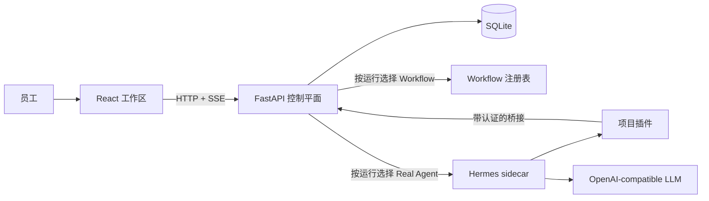

# 架构说明

## 系统边界

React 负责交互和渲染。FastAPI 负责稳定的公开协议、运行状态、持久化、审批、事件标准化和
Runtime 选择。每次运行都会存储所选 Runtime，因此同一会话可以混合两种模式。
`关键词分析` Workflow 是基于合成数据的确定性六步 DAG，发出与实时工具相同的标准事件。
Hermes 只负责实时 Agent 循环。项目插件在不修改上游源码的前提下增加业务工具和审批 Hook。
SQLite 让页面刷新和 SSE 重连能够恢复，而不是依赖浏览器内存。

## 请求生命周期与 Trace

下面十一项是参考 Claude Code Unpacked 的解释性生命周期，不是十一个源码目录：

| 阶段 | ZC Agent Desk 的职责 |
| --- | --- |
| Input | React 校验并发送员工消息。 |
| Message | FastAPI 持久化用户消息并创建运行。 |
| History | 加载历史持久化消息作为多轮上下文。 |
| System | Runtime 指令和可用工具共同定义行为。 |
| API | Workflow 在本机运行；Real Agent 调用已配置的兼容接口。 |
| Tokens | 流式 delta 转换为有序 `message.delta` 事件。 |
| Tools | Runtime 选择并校验业务工具或开发者工具。 |
| Loop | 最终生成前，工具结果返回 Runtime。 |
| Render | React 把重放事件折叠为聊天、审批和 Trace 视图。 |
| Hooks | 项目 Hook 执行开发者工具策略并维护桥接关联。 |
| Await | 写工具和开发者工具阻塞，直到批准、拒绝、超时或取消。 |

## 工具与审批流程

`query_mock_business` 是只读操作，会立即执行。`create_todo` 是写操作：插件提交与 run ID
关联的提案，FastAPI 持久化 `approval.required` 事件，调用随后阻塞。审批与副作用持久化以
事务和幂等方式完成；拒绝或重放不会创建待办。macOS 上的 terminal/file 工具使用相同应用
审批路径，并额外经过本机 `sandbox-exec` 策略与 realpath/symlink 检查。其他操作系统会
禁用这些工具，因为工作目录配置不等于沙箱。

## 运行与事件协议

运行状态依次经过 `queued -> running -> awaiting_approval -> running`，最终进入
`completed`、`failed` 或 `cancelled`。审批和取消接口均为幂等。有序事件序号支持使用
`Last-Event-ID` 进行 SSE 重放；最终消息和工具结果也会写入 SQLite。

## 故障边界

供应商诊断信息在到达浏览器前会被脱敏。选择不可用的 Real Agent 时，会在持久化消息或运行
之前返回 HTTP 503，绝不静默回退。无效工具参数、Hermes 不可用、审批超时、数据库失败和
取消都会转化为显式终止状态。Workflow 测试不会调用网络服务。macOS 执行策略只是本机演示
的纵深防御，不构成生产级安全声明。
